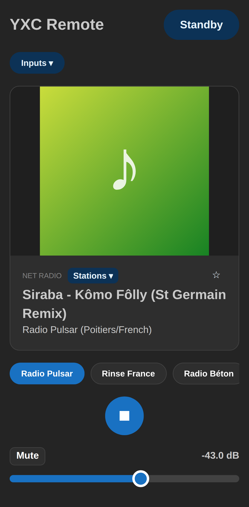
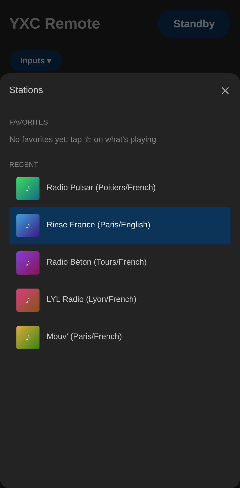
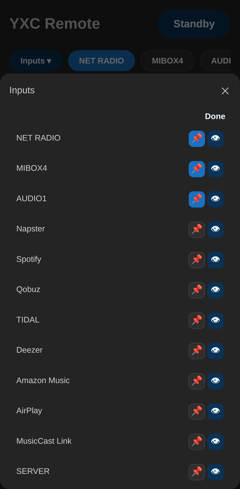

# YXC Remote

A fast, simple remote for Yamaha MusicCast AV receivers, for your phone and your desktop.
Unofficial, not affiliated with Yamaha. Tested with the HTR-4072.

<p align="center">
  
</p>

<p align="center">
  
  
  
</p>

<sub>Recorded against a simulated receiver (`npm run showcase`); album art is a placeholder.</sub>

- **Finds your receiver** on the local network automatically
- **Now playing**: artwork, track, station
- **Volume** in dB, as on the receiver's display, with an adjustable cap to protect your ears and speakers, plus mute and power
- **Play / pause / skip**, showing only the buttons the source supports
- **Pinned inputs**: one tap to switch to the inputs you actually use; hide the others
- **Radio stations**: favorites and recently played, one tap away
- **Instant updates**: change the volume with the Yamaha remote and the app follows
- **Android**: your phone's volume keys control the receiver, and the notification and lock screen show what's playing, with a volume slider and play/pause

## Download

Get the files from the [latest release](https://github.com/hadrien-f/yxc-remote/releases/latest):

| Platform | File | Install |
|---|---|---|
| Android 7.0+ | `yxc-remote_<version>_universal.apk` | Open it on the phone and allow installing from this source. |
| Debian / Ubuntu | `yxc-remote_<version>_amd64.deb` | `sudo apt install ./yxc-remote_<version>_amd64.deb` |
| Fedora / openSUSE | `yxc-remote-<version>-1.x86_64.rpm` | `sudo dnf install ./yxc-remote-<version>-1.x86_64.rpm` |
| Any Linux | `yxc-remote_<version>_amd64.AppImage` | `chmod +x` it, then run it. |

The APK is signed with the key whose certificate SHA-256 fingerprint is
`6a:99:23:77:b1:0b:7a:c4:74:ea:c0:18:4f:fc:6a:ff:d2:d7:93:55:12:e4:b0:0c:a4:d8:f3:80:2c:82:fe:64`.

The phone or computer must be on the same network as the receiver.

## Run it from source

```sh
cd app
npm install
npm run tauri dev
```

Needs Node 22+, Rust, and the [Tauri prerequisites](https://tauri.app/start/prerequisites/).
Android builds: see [IMPLEMENTATION.md](IMPLEMENTATION.md#android).
How it works: [IMPLEMENTATION.md](IMPLEMENTATION.md). What's next: [MILESTONES.md](MILESTONES.md).

## Dependencies

Direct dependencies only. Everything in the full tree (npm, Cargo, Gradle) is under permissive licenses (MIT, Apache-2.0, BSD, ISC, Zlib, Unicode-3.0), MPL-2.0 or LGPL (LAME), all compatible with the AGPL.

| Dependency | Used for | License |
|---|---|---|
| [Tauri](https://tauri.app) 2 (`tauri`, `tauri-build`, `@tauri-apps/api`, `@tauri-apps/cli`) | Desktop and Android shell | Apache-2.0 OR MIT |
| [tauri-plugin-http](https://github.com/tauri-apps/plugins-workspace) 2.6 (Rust + JS) | Requests to the receiver from Rust, no CORS | Apache-2.0 OR MIT |
| [serde](https://serde.rs), serde_json | JSON in Rust | MIT OR Apache-2.0 |
| [LAME](https://lame.sourceforge.io) 3.100, via [mp3lame-encoder](https://github.com/DoumanAsh/mp3lame-encoder) / mp3lame-sys | MP3 encoding when casting phone audio | LGPL-2.0 (LAME), LGPL-3.0 (bindings) |
| [React](https://react.dev) 19, react-dom | UI | MIT |
| [Mantine](https://mantine.dev) 9 (`@mantine/core`, `@mantine/hooks`) | UI components | MIT |
| [AndroidX](https://developer.android.com/jetpack/androidx) media, appcompat, webkit, activity, lifecycle | Android media session, notification, app shell | Apache-2.0 |
| [Material Components for Android](https://github.com/material-components/material-components-android) | Android theme | Apache-2.0 |
| [Lucide](https://lucide.dev) "speaker" icon | App and notification icon | ISC |

Development only:

| Dependency | Used for | License |
|---|---|---|
| [Vite](https://vite.dev) 8, @vitejs/plugin-react | Dev server and bundler | MIT |
| [TypeScript](https://www.typescriptlang.org) 6 | Type checking | Apache-2.0 |
| [Vitest](https://vitest.dev) 5 | Service tests | MIT |
| [Playwright](https://playwright.dev) | Browser end-to-end tests | Apache-2.0 |
| [selenium-webdriver](https://www.selenium.dev), [tauri-driver](https://crates.io/crates/tauri-driver) | Smoke tests on the real app | Apache-2.0 / Apache-2.0 OR MIT |
| @types/node, @types/react, @types/react-dom | Type definitions | MIT |

Lucide icons: Copyright (c) Lucide Icons and Contributors, ISC License (https://lucide.dev/license).

This app uses LAME (https://lame.sourceforge.io), statically linked and unmodified. Its source is in the mp3lame-sys crate, and the app can be rebuilt against a modified LAME from this repository.

## License

Copyright (C) 2026 hadrien-f.
YXC Remote is free software: you can redistribute it and/or modify it under the terms of the
GNU Affero General Public License, version 3 or (at your option) any later version. See [LICENSE](LICENSE).

## Trademarks

Yamaha and MusicCast are trademarks of Yamaha Corporation. This project is independent: it is not
affiliated with, endorsed by, or sponsored by Yamaha. The names are used only to say which devices it works with.
